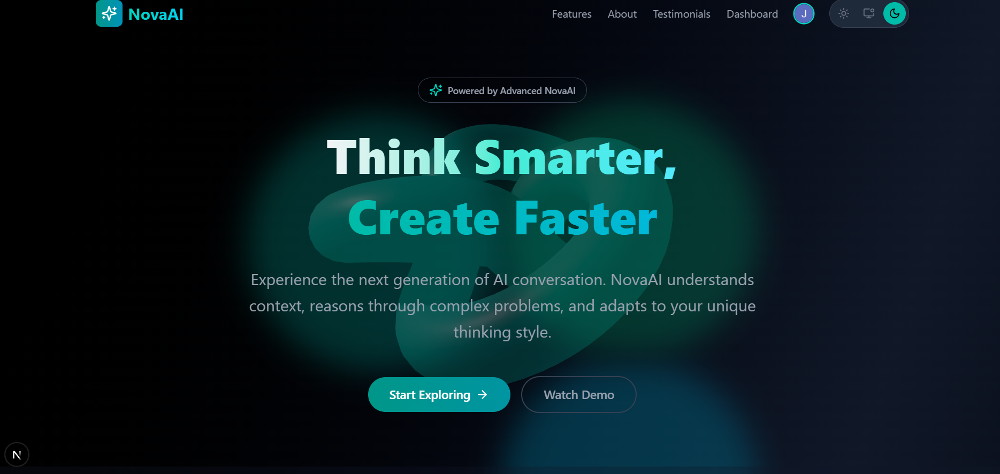

# NovaAI - Your Intelligent Chat Companion




NovaAI is a modern, responsive, and feature-rich AI chat application, similar to platforms like ChatGPT or Deepseek. It's built with Next.js, TypeScript, Tailwind CSS, and leverages Google's Gemini AI for its conversational capabilities. It includes user authentication via Clerk, chat history management with MongoDB, and subscription handling with Stripe.

## ✨ Features

*   **Real-time AI Chat:** Powered by Google Gemini for intelligent and contextual conversations.
*   **User Authentication:** Secure sign-up and sign-in using Clerk.
*   **Chat History:** Persistent chat history stored in MongoDB, allowing users to revisit past conversations.
*   **File Uploads (Pro Feature):** Attach and discuss PDF, DOCX, TXT, and image files with the AI.
*   **Speech-to-Text Input:** Use your microphone to dictate messages.
*   **Streaming Responses:** AI responses are streamed in real-time for a fluid user experience.
*   **Subscription Model (Stripe):**
    *   Free tier with basic features.
    *   Pro tier unlocking advanced features (e.g., file uploads, higher message limits).
    *   Stripe Checkout for subscriptions and Billing Portal for managing subscriptions.
*   **Theming:** Light, Dark (Current), and Deep Dark themes with a user-friendly switcher.
*   **Responsive Design:** Optimized for desktop, tablet, and mobile devices.
*   **Modern UI/UX:** Clean interface with smooth animations using Framer Motion.
*   **Chat Management:** Rename and delete chats.
*   **Quick Actions:** Suggested prompts to easily start conversations.
*   **Interactive 3D Elements:** Engaging visuals on the homepage.

## 🛠️ Tech Stack

*   **Frontend:**
    *   [Next.js](https://nextjs.org/) (App Router)
    *   [React](https://reactjs.org/)
    *   [TypeScript](https://www.typescriptlang.org/)
    *   [Tailwind CSS](https://tailwindcss.com/)
    *   [Framer Motion](https://www.framer.com/motion/) (for animations)
    *   [Lucide React](https://lucide.dev/) (for icons)
    *   [React Toastify](https://fkhadra.github.io/react-toastify/) (for notifications)
    *   [React Syntax Highlighter](https://github.com/react-syntax-highlighter/react-syntax-highlighter) (for code blocks)
    *   [React Markdown](https://github.com/remarkjs/react-markdown) (for rendering Markdown)
    *   [Three.js / React Three Fiber / Drei](https://github.com/pmndrs/react-three-fiber) (for 3D elements)
*   **Backend:**
    *   Next.js API Routes
*   **AI Model:**
    *   [Google Gemini API](https://ai.google.dev/)
*   **Authentication:**
    *   [Clerk](https://clerk.com/)
*   **Database:**
    *   [MongoDB](https://www.mongodb.com/) (with Mongoose or native MongoDB driver)
*   **Payments & Subscriptions:**
    *   [Stripe](https://stripe.com/)
*   **File Processing (Optional - if PDF/DOCX parsing is fully enabled):**
    *   `pdf-parse` (for PDF text extraction)
    *   `mammoth` (for DOCX text extraction)

## 🚀 Getting Started

### Prerequisites

*   [Node.js](https://nodejs.org/) (v18.x or later recommended)
*   [npm](https://www.npmjs.com/) or [yarn](https://yarnpkg.com/)
*   A MongoDB Atlas account (or local MongoDB instance)
*   A Clerk account
*   A Google AI Studio account (for Gemini API Key)
*   A Stripe account

### Installation & Setup

1.  **Clone the repository:**
    ```bash
    git clone https://your-repository-url/nova-ai.git
    cd nova-ai
    ```

2.  **Install dependencies:**
    ```bash
    npm install
    # or
    yarn install
    ```

3.  **Set up Environment Variables:**
    Create a `.env.local` file in the root of your project and add the following environment variables with your actual keys and configurations:

    ```env
    NEXT_PUBLIC_CLERK_PUBLISHABLE_KEY=pk_test_your_clerk_publishable_key
    CLERK_SECRET_KEY=sk_test_your_clerk_secret_key
    NEXT_PUBLIC_CLERK_SIGN_IN_URL=/sign-in
    NEXT_PUBLIC_CLERK_SIGN_UP_URL=/sign-up
    NEXT_PUBLIC_CLERK_AFTER_SIGN_IN_URL=/dashboard
    NEXT_PUBLIC_CLERK_AFTER_SIGN_UP_URL=/dashboard

    GEMINI_API_KEY=your_gemini_api_key

    MONGODB_URI="your_mongodb_connection_string"
    MONGODB_DB_NAME=nova_ai_db

    STRIPE_SECRET_KEY=sk_test_your_stripe_secret_key
    NEXT_PUBLIC_STRIPE_PUBLISHABLE_KEY=pk_test_your_stripe_publishable_key
    STRIPE_WEBHOOK_SECRET=whsec_your_stripe_webhook_secret

    NEXT_PUBLIC_STRIPE_PRO_PRICE_ID=price_your_pro_plan_price_id

    NEXT_PUBLIC_APP_URL=http://localhost:3000
    ```

4.  **Set up Stripe Webhook:**
    *   In your Stripe dashboard, go to Developers > Webhooks.
    *   Add an endpoint for `http://localhost:3000/api/stripe/webhooks` (for local development) or your production URL.
    *   Listen to the following events (or as needed):
        *   `checkout.session.completed`
        *   `customer.subscription.created`
        *   `customer.subscription.updated`
        *   `customer.subscription.deleted`
        *   `invoice.paid`
        *   `invoice.payment_failed`
    *   After creating the endpoint, Stripe will provide a "Signing secret" (starts with `whsec_`). Use this for your `STRIPE_WEBHOOK_SECRET` in `.env.local`.
    *   For local development, you'll need to use the Stripe CLI to forward webhook events to your local server: `stripe listen --forward-to localhost:3000/api/stripe/webhooks`

5.  **Run the development server:**
    ```bash
    npm run dev
    # or
    yarn dev
    ```
    Open [http://localhost:3000](http://localhost:3000) with your browser to see the result.

## 📂 Project Structure
nova-ai-project/
├── app/
│ ├── (auth)/
│ ├── api/
│ ├── components/
│ │ ├── auth/
│ │ ├── chat/
│ │ ├── home/
│ │ └── ui/
│ ├── context/
│ ├── dashboard/
│ ├── pricing/
│ ├── clerk-theme.ts
│ ├── CustomToast.tsx
│ ├── globals.css
│ ├── layout.tsx
│ └── page.tsx
├── hooks/
├── lib/
├── public/
├── types/
├── .env.local
├── middleware.ts
├── next.config.mjs
├── package.json
├── tailwind.config.ts
└── tsconfig.json

## 📜 API Endpoints

*   `/api/chat`: Handles AI chat requests and streams responses.
*   `/api/chats`: GET user's chats, POST to create a new chat.
*   `/api/chats/[id]`: GET specific chat, POST messages to chat, PATCH to update (e.g., rename), DELETE chat.
*   `/api/user/status`: GET current user's subscription status.
*   `/api/user/sync`: POST to synchronize Clerk user data with the local database.
*   `/api/stripe/create-checkout-session`: POST to create a Stripe Checkout session for subscriptions.
*   `/api/stripe/create-portal-session`: POST to create a Stripe Billing Portal session.
*   `/api/stripe/webhooks`: POST endpoint for Stripe to send webhook events.

## 🎨 Theming

The application supports three themes: "Light", "Current" (default dark), and "Deep Dark". Theme preferences are stored in `localStorage` and applied via CSS variables defined in `app/globals.css`. The `ThemeSwitcher` component in `app/components/ui/ThemeSwitcher.tsx` handles theme changes.

## 🚀 Deployment

*   **Vercel:** Recommended for Next.js projects. It integrates seamlessly with Next.js features and provides easy environment variable management.
*   **Other Platforms:** (Netlify, AWS Amplify, Docker, etc.) Ensure your chosen platform supports Node.js and Next.js. You'll need to configure environment variables on the platform.

Remember to update `NEXT_PUBLIC_APP_URL` to your production URL for Stripe redirects and webhook configurations.

## 🤝 Contributing

Contributions are welcome! If you have suggestions or want to improve NovaAI, please feel free to:

1.  Fork the repository.
2.  Create your feature branch (`git checkout -b feature/AmazingFeature`).
3.  Commit your changes (`git commit -m 'Add some AmazingFeature'`).
4.  Push to the branch (`git push origin feature/AmazingFeature`).
5.  Open a Pull Request.

## 📄 License

This project is licensed under the [MIT License](LICENSE.md) - see the `LICENSE.md` file for details.

## 🙏 Acknowledgements

*   [Next.js Team](https://nextjs.org/)
*   [Clerk Team](https://clerk.com/)
*   [Google Gemini Team](https://ai.google.dev/)
*   [Stripe Team](https://stripe.com/)
*   [Tailwind CSS Team](https://tailwindcss.com/)
*   [Framer Motion Team](https://www.framer.com/motion/)
*   [Lucide Icons](https://lucide.dev/)
